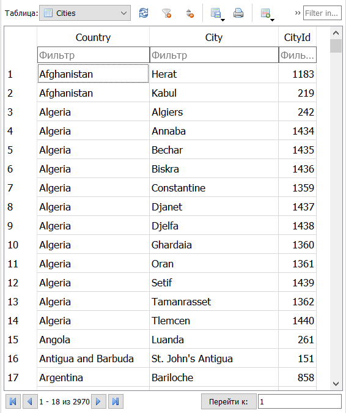
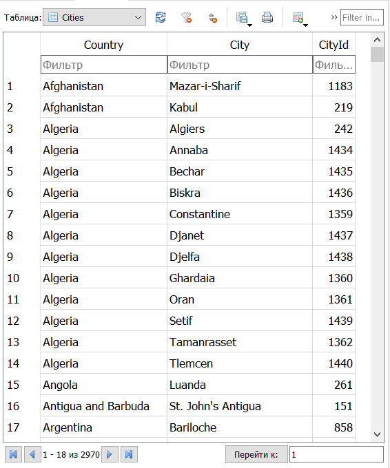

# Задание к Занятию 5.

**Задание:**

Используя sqlite3, напишите код, который создает таблицу базы данных для датасета с CityId городов различных стран мира, приведенного в файле 
https://worldweather.wmo.int/en/json/full_city_list.txt. Предусмотреть функцию, позволяющую вносить изменения в базу данных. Продемонстрировать её работу.

**Решение:**

1. Создание базы данных my_database.db.
2. Создание таблицы Cities
3. Зазгузка и чтение файла full_city_list.txt в csv reader. 
На данном этапе подготавливается список кортежей my_list (очещенный от заголовков и лишних строк список имеет имя my_list_clear), который выглядит следующим образом:
[('Afghanistan', 'Herat', '1183'), ('Afghanistan', 'Kabul', '219'),...]
4. Внесение значений списка my_list_clear в базу данных и фиксация изменений.
5. Выполнение закрытия csv файла, закрытие курсора и соединения.
Созданную базу данных my_database.db можно посмотреть с помощью браузера DB Browser for SQLite, скриншот таблицы представлен ниже:

6. Создание функции update_sqlite_table, которая позволяет вносить изменения в базу данных.
Данная функция позволяет выполнять обновление одной записи в таблице SQLite. Для примера, было изменено название города в столбце "Citi", с "Herat" на "Mazar-i-Sharif" по значению "1183" из столбца "CityId".
Скриншот изменений (в первой строке таблицы) представлен ниже.

